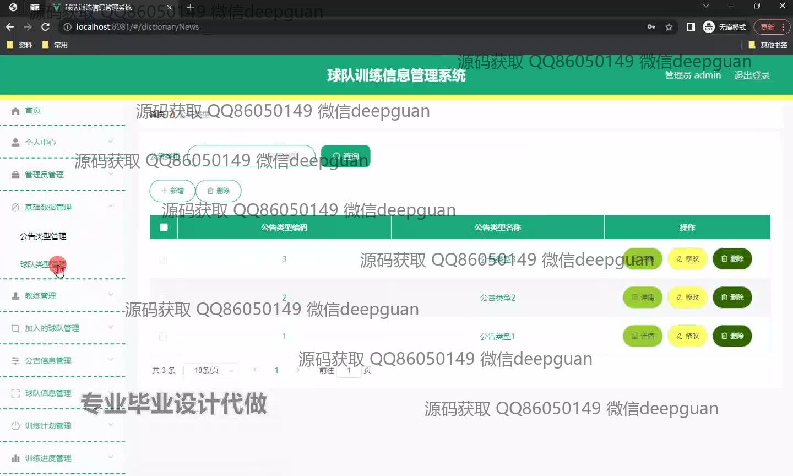
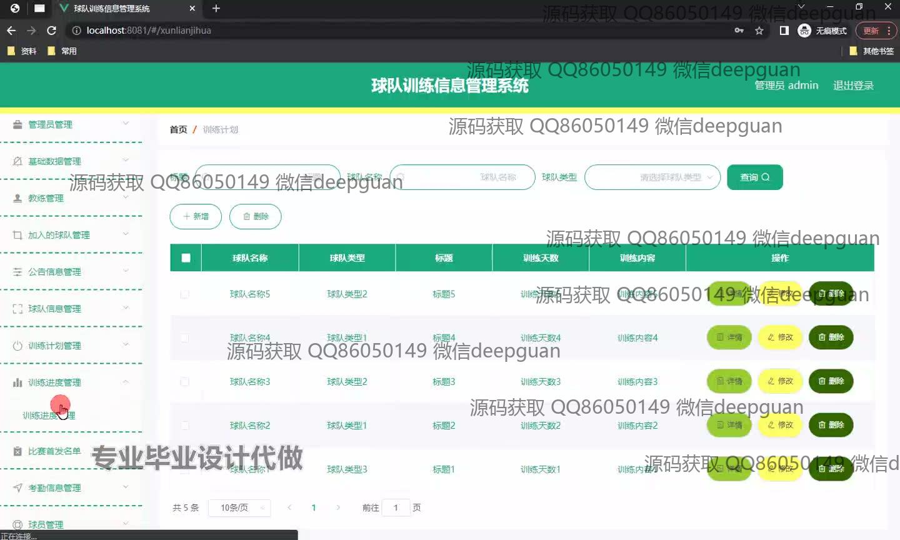
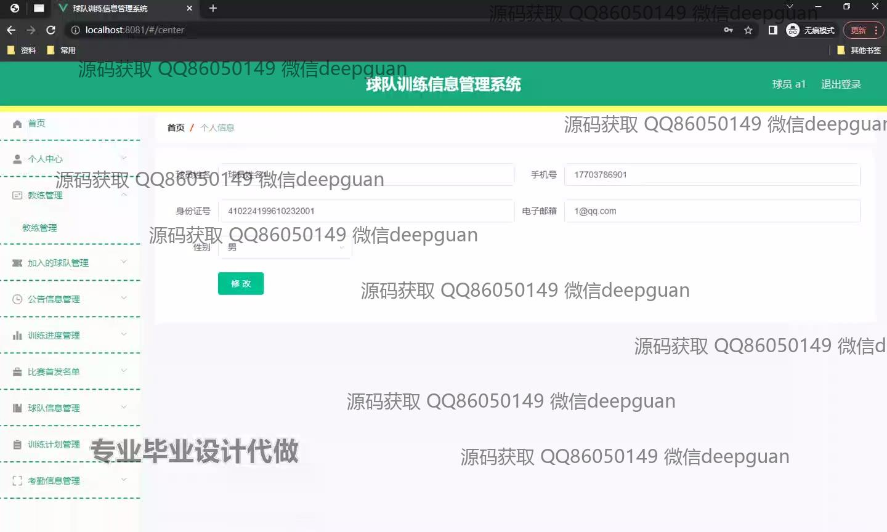
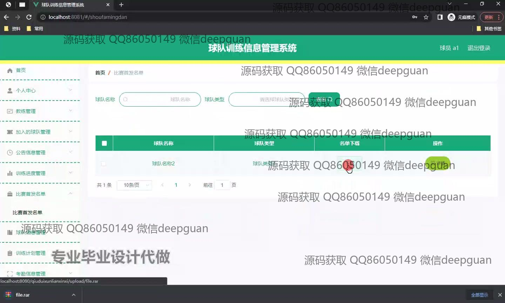
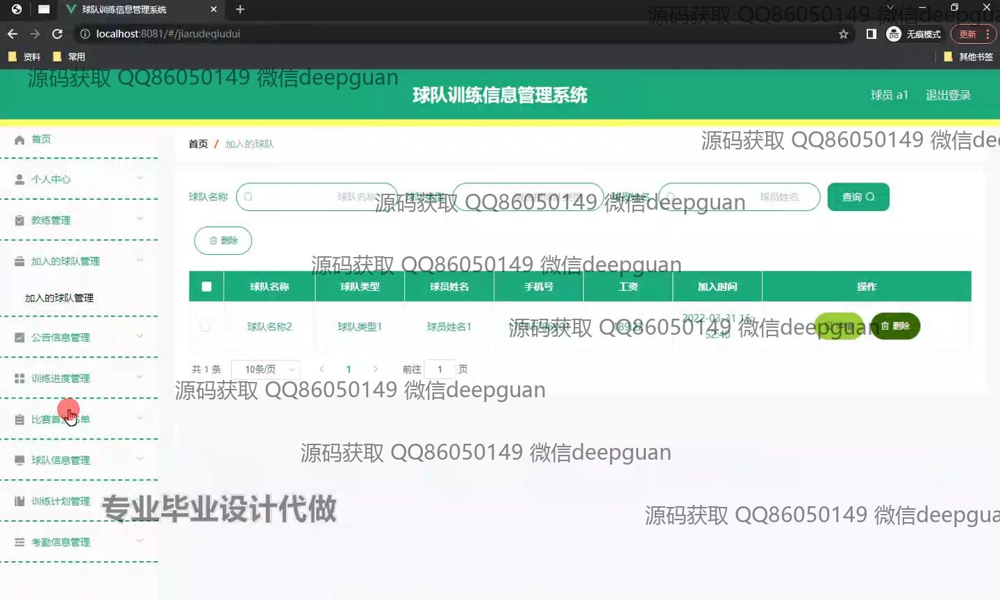
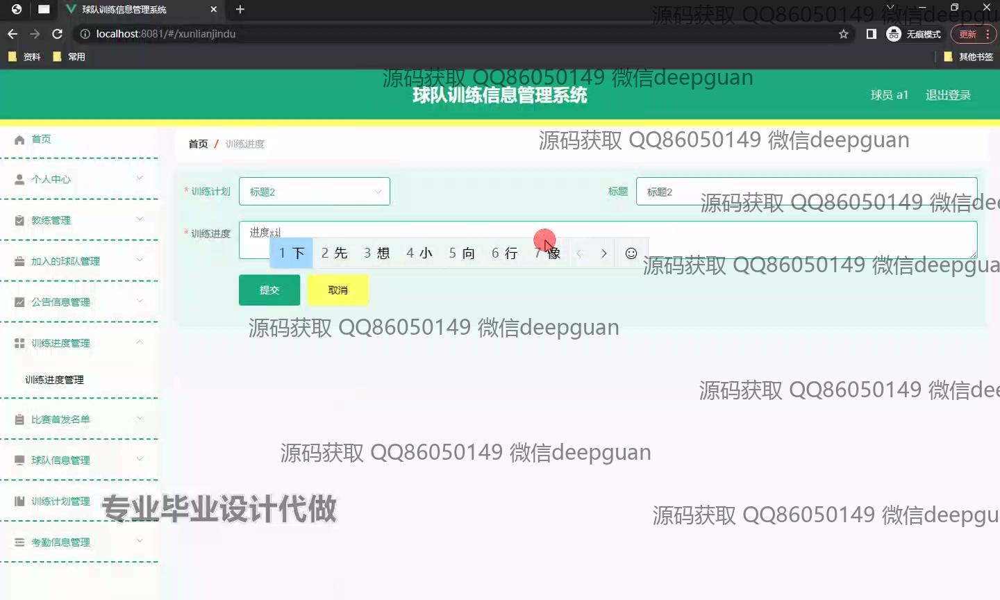
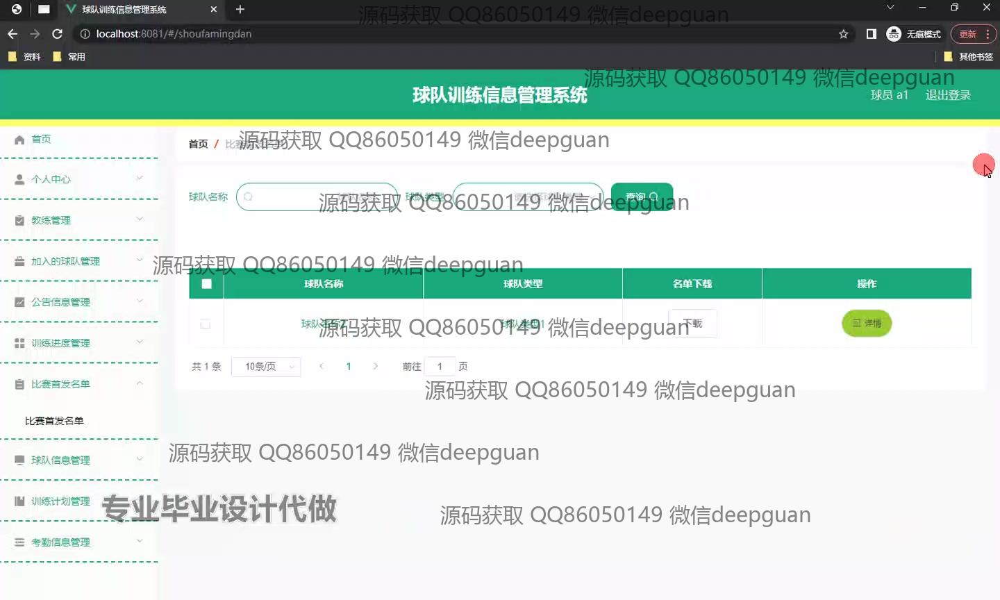
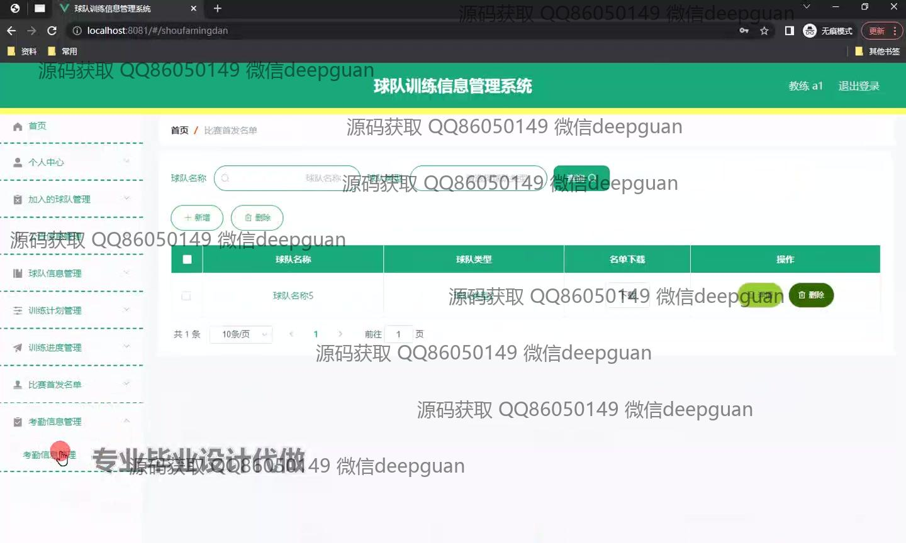

<h1 align="center">球队训练信息管理系统</h1>

## 简介
球队训练信息管理系统：角色分为管理员、用户；功能包括管理员管理、个人信息管理、球队信息管理、公告信息管理、教练管理、训练计划管理、比赛信息管理和考勤管理，支持信息查询和操作。    --计算机毕业设计源码；毕设源码；java毕业设计源码

## 联系方式

<h3 align="center">获取完整代码与数据库文件 + 微信：deepguan QQ: 86050149 QQ群: 783742310</h3>

<h3 align="center">可帮忙远程部署 包运行成功！提供远程部署、修改代码、设计文档指导、代码讲解等服务！</h3>

## 功能介绍（完整见运行截图）
管理员： 基本功能包括登录、注册、退出登录等操作，并可查看系统公告类型以及进行增删改管理。管理员可以访问和管理基本数据、球队类型与信息、教练数据，并拥有公告信息发布管理的权限。在界面中，可通过搜索栏和下拉菜单进行数据筛选和查看详细信息，并能有效管理球队训练进度和计划。

教练： 可以通过系统查看和管理自己负责的球队及球员信息，查看球队的训练进度及计划，支持对训练进度细节进行更新与提交操作。教练能够访问球队管理、训练计划管理、比赛信息管理等模块，协助管理球队名单和筛选关键训练数据，帮助优化管理流程。

用户： 用户能够在系统中进行登录和注册，并可在个人中心查看和修改自己的基本信息。用户可以查看加入球队的具体信息，包括球员姓名、联系方式、工资等。提供通过搜索框及菜单进行数据筛选的功能，并能查看球队详细资料，支持名单下载及相关操作。

球员： 球员可以在个人中心查看和更新个人信息，包括姓名、联系信息及身份证号。球员有权限查看球队公告与训练安排，了解自己的训练情况和进度。用户界面也允许球员参与到训练计划及比赛信息的查询中，通过系统提供的不同模块方便快捷地处理个人及球队相关信息。

## 运行截图

本代码来源于网络,仅供学习参考使用!

